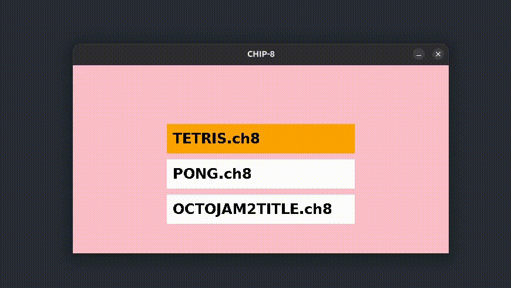

# Simple-Chip8-Emulator
Questo progetto è un emulatore CHIP-8 scritto in C, con interfaccia grafica SDL2, audio e gestione del menu. L’obiettivo è creare un emulatore completo e aggiungere funzionalità extra per il portfolio, mostrando la capacità di comprendere e implementare un’architettura virtuale storica.

# Caratteristiche principali
Core CHIP-8 completo (chip8.c) con fetch-decode-execute
Gestione dei timer, audio e input
Menu grafico SDL2 con selezione delle ROM e sfondo rosa
Supporto a più ROM: TETRIS, PONG, OCTOJAM2TITLE
Save/Load dello stato della macchina (S/L)
Comportamenti “quirky” configurabili tramite macro:
QUIRK_LOADSTORE_I_INC
QUIRK_SHIFT_VY
QUIRK_SPRITE_WRAP
Tutti i giochi partono correttamente e gestiscono il wrapping dei pixel

# Istruzioni per compilazione

- Assicurati di avere installato SDL2 e SDL2_ttf:

```bash
sudo apt install libsdl2-dev libsdl2-ttf-dev
```
# Compilazione:
```bash
gcc main.c chip.c -o chip -lSDL2 -lSDL2_ttf -std=c99
```
# Esecuzione:
```bash
./chip8
```
# Comandi
- Freccia SU/GIÙ → Seleziona ROM nel menu
- INVIO/ENTER → Avvia ROM selezionata
- ESC → Esci
- Tasti 1–4, QWER, ASDF, ZXCV → Mappa CHIP-8
- S → Salva stato in save.ch8
- L → Carica stato da save.ch8

# Note personali

Questo progetto nasce dallo studio della documentazione ufficiale CHIP-8 e da tutorial online.
Ho seguito tutorial per comprendere la logica di base, ma tutte le personalizzazioni del menu grafico, l’interfaccia, la gestione dei salvataggi e il miglioramento della compatibilità delle ROM sono state aggiunte personalmente.

# Miglioramenti futuri

- Effetti grafici extra sul menu (pixel lampeggianti, animazioni)
- Interfaccia audio più avanzata
- Supporto a più ROM contemporaneamente
- Modalità “debug” con visualizzazione registro e opcode corrente

# Demo


